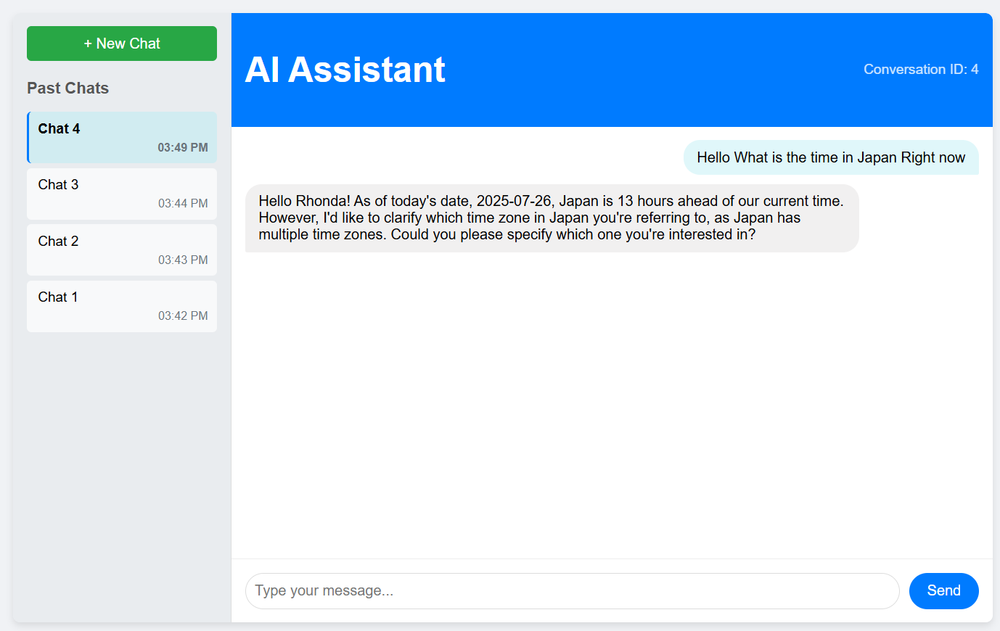

# AI Conversational Agent
# Demo Video


[]
)](https://youtu.be/z_BXsDOP-h0)

Click the image above to watch a demo of the AI Conversational Agent.


## Project Overview

This project implements a full-stack AI conversational agent designed to assist users with e-commerce queries, specifically focusing on product information and order status. The solution is built with a Python FastAPI backend, a React frontend, and a MySQL database, all orchestrated using Docker Compose for easy setup and deployment. The backend integrates with the Groq API for large language model (LLM) capabilities, enabling intelligent and contextual responses. However i couldn't complete the last milestone that is creating Docker-compose.yaml. But i have completed previous 9 milestones and i have attached a video as a proof of completion. 

## Features

### Backend (FastAPI)


* **API Endpoints**: Provides RESTful APIs for chat interactions, user management, and retrieving conversation history.
* 
* **LLM Integration**: Seamlessly integrates with Groq's LLM to generate intelligent responses.
* **Intent Recognition & Entity Extraction**: Uses the LLM to identify user intent (e.g., product search, order status) and extract relevant entities (e.g., product names, order IDs).
* **Database Querying**: Dynamically queries an e-commerce MySQL database to retrieve product details and order information based on user requests.
* **Conversation Persistence**: Stores complete conversation histories (user messages and AI responses) in the MySQL database, linked to specific users and sessions.
* **Database Management**: Connects to and interacts with a MySQL database using SQLAlchemy ORM.

### Frontend (React)
* **Intuitive Chat Interface**: A clean and user-friendly chat UI for seamless interaction.
* **Real-time Communication**: Communicates with the FastAPI backend using `fetch` API to send messages and receive AI responses.
* **Conversation History Panel**: Displays a sidebar with a list of past chat sessions, allowing users to select and resume conversations.
* **Enhanced User Experience**: Includes features like loading indicators for AI responses, automatic scroll-to-bottom for new messages, and clearing the input field after sending.

### Dockerization


* **Containerized Services**: Backend, Frontend, and MySQL database are all containerized using Docker.
* **Docker Compose Orchestration**: `docker-compose.yml` simplifies the build, run, and networking of all services.
* **Portability**: Enables consistent deployment across various environments.

## Technologies Used

* **Backend**:
    * Python 3.10
    * FastAPI
    * SQLAlchemy (ORM)
    * `mysql-connector-python`
    * Groq API (for LLM)
    * `python-dotenv`
* **Frontend**:
    * React.js (created with Create React App)
    * HTML, CSS (for styling)
    * JavaScript (`fetch` API for HTTP requests)
    * Nginx (serving static files in Docker)
* **Database**:
    * MySQL 5.7 (running in Docker container)
* **Containerization**:
    * Docker
    * Docker Compose

## Setup Instructions

Follow these steps to get the application running on your local machine.

### Prerequisites

* **Docker Desktop**: Ensure Docker Desktop is installed and running on your system (Windows, macOS). This includes Docker Engine and Docker Compose.
* **Git**: For cloning the repository.
* **MySQL Workbench (Optional but Recommended)**: For direct interaction with your MySQL database running in Docker.

### Clone the Repository

First, clone the project repository to your local machine:

```bash
git clone [https://github.com/your-username/think41l2.git](https://github.com/your-username/think41l2.git) # Replace with your actual repo URL
cd think41l2
```


## Deployment Guide

This section outlines the general steps and considerations for deploying your Dockerized AI Conversational Agent to a cloud environment. The approach will vary slightly depending on your chosen cloud provider (e.g., AWS, Google Cloud, Azure, Heroku, Render, DigitalOcean).

The core idea is to:

1. Push your Docker images to a container registry.

2. Provision the necessary cloud services.

3. Configure network and environment variables for inter-service communication and external access.

### High-Level Deployment Steps

1.  **Build Production-Ready Docker Images Locally:**
    Ensure your images (`ai-backend`, `ai-frontend`) are built for production. For the frontend, `npm run build` within the Dockerfile already creates optimized static assets.

    ```bash
    # From your project root (think41l2/)
    docker compose build # This builds both backend and frontend images
    ```

2.  **Authenticate to a Container Registry:**
    You'll need a Docker Hub account or an account with a cloud provider's container registry (e.g., AWS ECR, Google Container Registry, Azure Container Registry).

    ```bash
    docker login # For Docker Hub
    # or login command specific to your cloud provider's registry
    ```

3.  **Tag and Push Docker Images to Registry:**
    Tag your local images with the registry's name and push them.

    ```bash
    # For backend
    docker tag ai-backend your_registry_username/ai-backend:latest # Replace your_registry_username
    docker push your_registry_username/ai-backend:latest

    # For frontend
    docker tag ai-frontend your_registry_username/ai-frontend:latest # Replace your_registry_username
    docker push your_registry_username/ai-frontend:latest
    ```


* Push images to your container registry.

* Update and deploy your services to the cloud environment.

This provides a high-level overview. Each cloud provider has specific guides and services that map to these steps.
